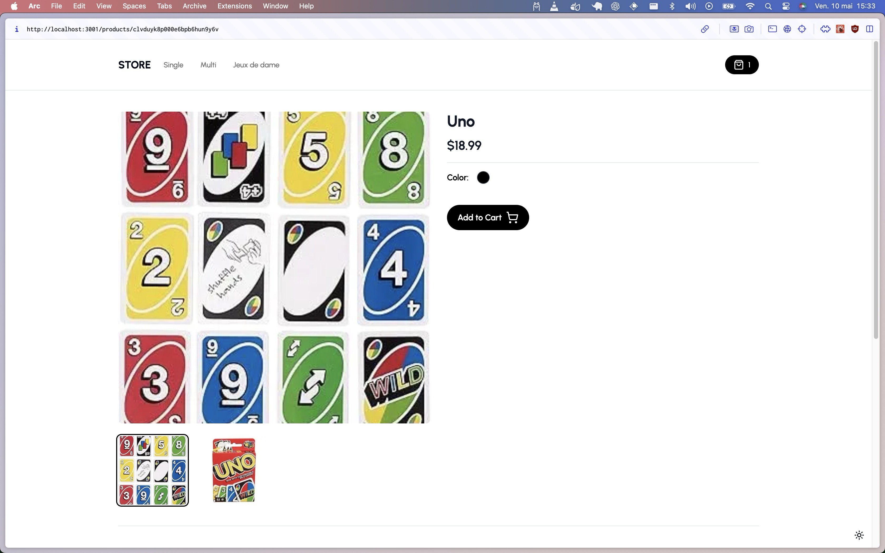
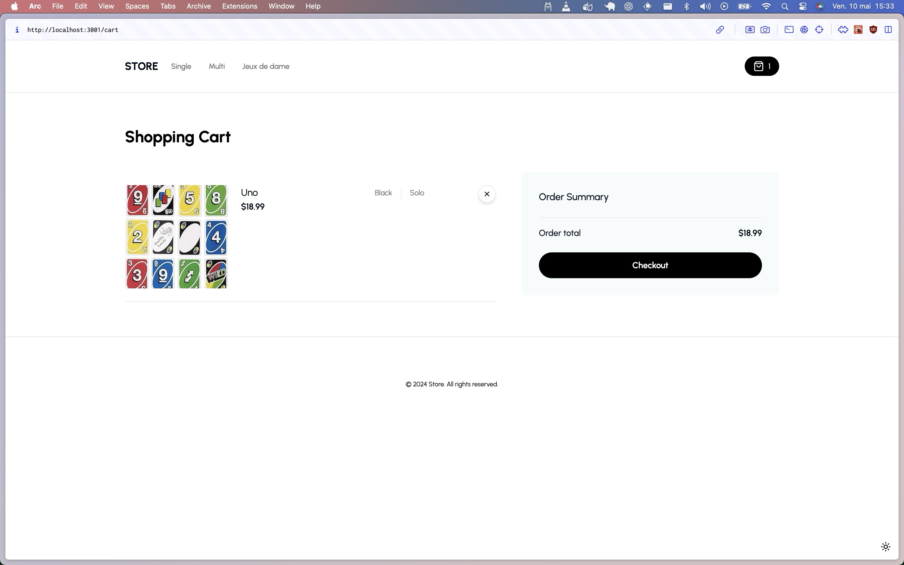

# E-Commerce Store 🛍️

(You can see the Store at my other repo [HERE](https://github.com/guillaume-flambard/nextjs-e-commerce-store))

`E-commerce Store` is a starter template made with Next.js 14, allowing you to quickly create an e-commerce Store interface.

---
<div style="display:flex;">
    
    
</div>

## 🤔 Why use E-Commerce Store

`E-Commerce Store`

## 🚀 Quick Start

### 🛠 Install dependencies

### 1.Use NPM ( Recommend )

```bash
npm install
```

### 2.Build

```bash
npm run build
```

### 3.Start the server

```bash
npm run dev
```

## ☔️ Dependencies

- [Next.js 14](https://nextjs.org/)
- [Tailwind CSS](https://tailwindcss.com/)
- [TypeScript](https://www.typescriptlang.org/)
- [ShadcnUI](https://shadcn.github.io/)

### ⚙️ Configuration

To configure the project, create a `.env.local` file in the root directory and add the following environment variables:

```bash
NEXT_PUBLIC_API_URL=http://localhost:3000/api/your-billboard-id # The URL of the API server (default: http://localhost:3000/api/billboard)
```

### 🙃 Start managing your e-commerce

(Be sure to have the [E-Commerce Admin](https://github.com/guillaume-flambard/nextjs-e-commerce-admin) running)

- Navigate to the store dashboard at `localhost:3001/`
- Use the provided interfaces to manage products, orders, and customer inquiries.
